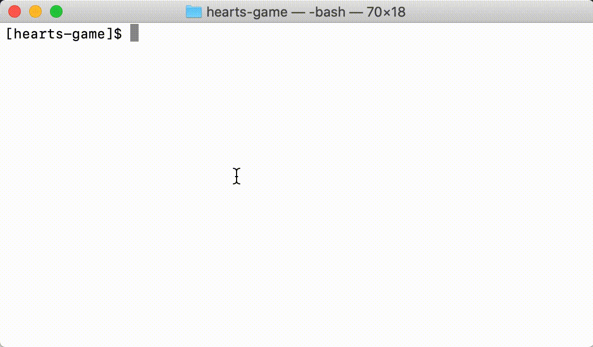
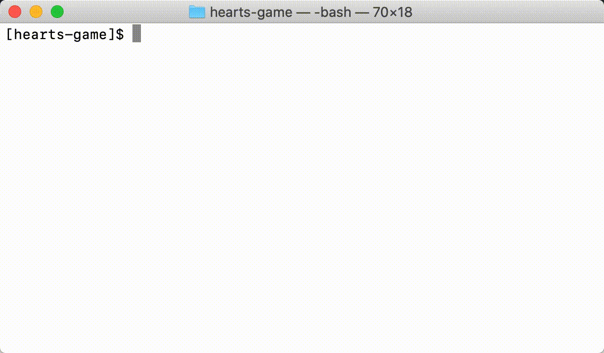

# hearts-game
A [Hearts trick-taking game](https://en.wikipedia.org/wiki/Hearts_(card_game)) built with purely functional language - [Haskell](https://www.haskell.org) to understand and improve [functional programming](https://en.wikipedia.org/wiki/Functional_programming) through design patterns skills. 

## Game Introduction
The game of Hearts is a trick-taking game where the goal to score as *few points* as possible. All cards in the Hearts are worth one point, and the Queen of Spade is worth 13.  The goal is to implement a simple AI to beat other players of this game.

At the core of the game of Hearts are the *point cards*: all cards in Hearts and the Queen of Spade.  The goal of the game is to score as few points as possible. An alternative exists though: if a player manages to take all point cards, she gets 0 points and *every other player* gets 26 points (the maximum).

At the end of each *round*, when players have played all the cards in their hands, we tally the points in every trick taken by each player. That is, we sum the point cards they won.

The game goes on until at least one player has scored more than 100 points *and* there is exactly one player with the lowest score. The player with the lowest score is the winner.

Counting points in Hearts is done as follows:

 1. **Point cards:** Each Hearts is worth 1 point, the Queen of Spades is worth
    13 points.
 2. **Hand:** At the end of each hand (players have played all their cards),
    each player receives the amount of points in the tricks they won.
 3. **Game:** The game stops when a player has reached 100 points and exactly
    one other has the lowest score; the latter is the winner.

## Game Implementation
Gameplay code is edited in [Player.hs](/staticgame/Player.hs)

## Testing the Game
Run the code below to run a single game test with four instances of the player.
```
stack test
```


## Running the Game
Run the code below to run a single game (that shows the result of each game instance)
```
stack run
```

